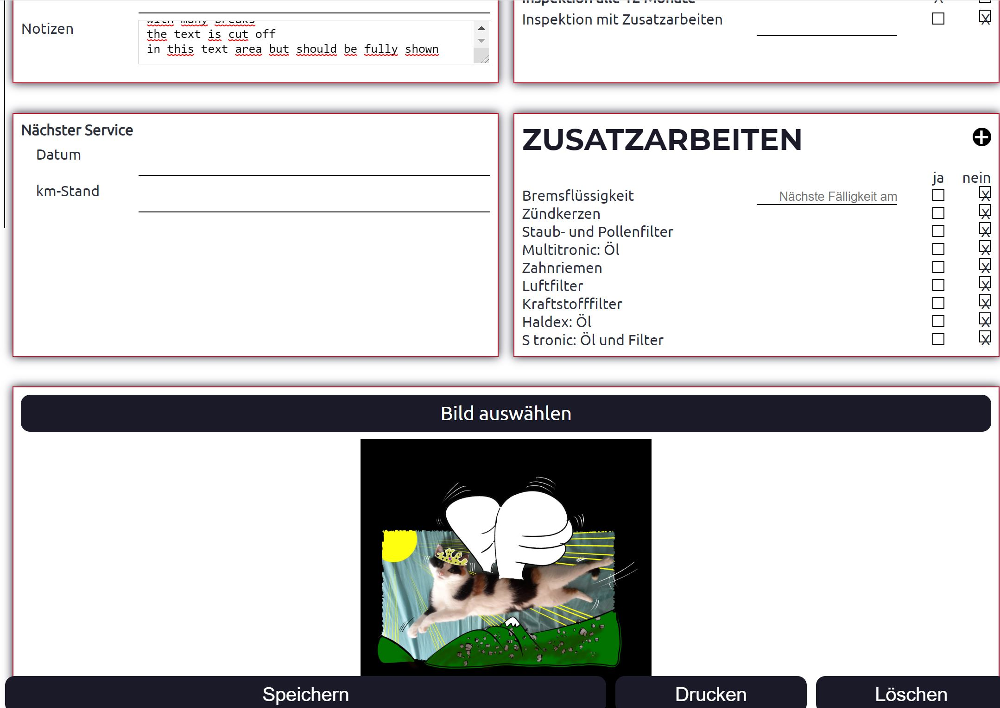
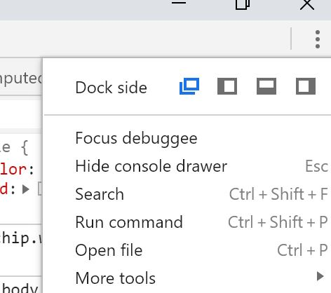
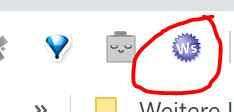

The Chrome Debugger Interface offers some features that sometimes save your time. This article shows you the low level API as well as links to additional resources. The latter also contain an official cypress example (written by me, so you can ask me questions about it in the comment section, too).

# My real world use case
A few months ago, a friend of mine wanted a digital replacement of the so called "Serviceheft".
If you fix something on the car, you make a new entry with the current date and all the stuff you fixed. Also you can check off predefined list entries. I am not sure how this is called in English. Let's name it "service history". I implemented it with `React` and `Electron`. 

> **_NOTE:_** 
Just a side note: Currently I refactor the whole application. 

See this example Screen (it is in German right now):


# Usage of Print Media Query
Maybe you noticed the "Print" button at the bottom of the app. It will print the whole page. But as you can imagine, when the entry gets printed, I do not want some elements to appear at the paper. E.g. the logo of the car manufacturer or the additional images at the bottom. Also I do not want the input elements to show up as "input" element. And the textarea should be resized to show the whole content. 

This is done by using a `print media query` that defines some extra CSS. The end result looks like this:

TODO add example screen

# Cypress tests
As I mentioned, I am refactoring the whole application. Typescript replaces all JS code, I replace all single elements by my own react component library and so on. Of course before doing this, I have written some tests to ensure that everything after the refactoring works exactly like before. Also the print stuff should be tested.

## Print view test
But how can this be accomplished? You can not set media queries with JavaScript and so you can not do this with `Cypress`. 
But if you take a look at your Chrome Dev Console, you maybe know the `Run Command` action:



This opens a list of all avaiable commands, including one for emulation the print query:


The good news is that as far as I know everything you can access from here can also be done programatically with the `Chrome Remote Debugger Protocol`.
The bad news is that often it is hard to discover how this must be done.

# Chrome Remote Debugger protocol
You communicate over network and calling HTTP endpoints. This can be done with plain JS code but it is recommended to use an abstraction layer so you do not need to worry about the concrete endpoints.

I will use `TODO: add package name` which is recommended by google (TODO: add link and source of this).

After getting the target tab, you have to connect to the debug ssession by using the provided websocket URL.

## Simple example with low level access
For the manual test I have used the extension https://chrome.google.com/webstore/detail/simple-websocket-client/pfdhoblngboilpfeibdedpjgfnlcodoo?hl=de which provides a lightweight generic websocket client but you can choose the client of your choice.

Follow these steps to navigate to a new URL using the protocol:
+ close all chrome windows (this is necessary otherwise chrome does not start in debug mode)
+ open Chrome through the comandline and specify the debug port: `chrome.exe --remote-debugging-port=9222` (9222 is the default port and can be changed)
    Chrome should be installed here: `C:\Program Files (x86)\Google\Chrome\Application`
+ open a new Chrome tab and navigate to https://google.com
+ open http://localhost:9222/json (can be done in the newly opened window or within another browser or through an ajax call)
    this will list all possible debug targets, including all extensions and your newly created tab **google.com**. In my case this is, what I get:
    ```json
    ...
    {
        "description": "",
        "devtoolsFrontendUrl": "/devtools/inspector.html?ws=localhost:9222/devtools/page/24B0DBC39A658BD7E26B5A4DCB704F88",
        "faviconUrl": "https://www.google.com/favicon.ico",
        "id": "24B0DBC39A658BD7E26B5A4DCB704F88",
        "title": "Google",
        "type": "page",
        "url": "https://www.google.com/",
        "webSocketDebuggerUrl": "ws://localhost:9222/devtools/page/24B0DBC39A658BD7E26B5A4DCB704F88"
    }
    ...
    ```

+ Here you need the websocket URL. You have to connect to this URL in order to control the tab.
    So open the mentioned extension by clicking the small icon: 
    
+ Copy & paste the WS URL into the client and click *open*:
    
    Now you should be ready to send messages to the tab.
+ Paste this JSON into the *Request* input and click *Send*:
    ```json
    {
        "id": 1,
        "method": "Page.navigate",
        "params": {
            "url": "https://example.com"
        }
    }
    ```
+ The tab should have changed the URL to http://example.com

Hint: *id* specifies a unique id to identify this message. I think it is only used in the response so that the developer can find the corresponding request to the incoming response.

## Using a wrapper around the websocket implementation
Writing down all those WS requests can be a little bit cumbersome. So it is recommended to use an existing wrapper. As already mentioned, I will use the [chrome-remote-interface](https://github.com/cyrus-and/chrome-remote-interface) package. Please go to it's [README.MD](https://github.com/cyrus-and/chrome-remote-interface/blob/master/README.md) to learn more about it's usage.

# Using it during your tests
There are some limitations when you use the protocol in your tests.
+ **Can be used with chrome only**
    You are not able to use those features when running the tests in electron because it does not fully implement the protocol right now
+ **Headless Chrome can only be used since Cypress 3.8.1**
    Normally when Chrome is used for Cypress, Chrome is started headed. But since 3.8.0 you can start Chrome headless. A Bugfix released in 3.8.1 is necessary to fix the headless mode for all clients. This means, you can not use it with Cypress before 3.8.0.
+ **Conflict with existing connection**
    If Cypress is started with `--browser chrome` parameter, a debug port is passed automatically. This means you can not specify the port you wish. A little trick is needed to resolve this.
+ **Resetting the chrome state**
    Whenever a spec file contains more than one test, the same browser instance is reused. This means, that you also use the same debugging session. And this introduces problems. Let's say, you activate the `print media query` in the first test which hides an element. Then in the next test, this element is missing, too. This holds true also if you reload the page. Do bypass this behavior you need to reset the browser state before or after each test which may introduce subsequent problems.

## Full runnable example
You can copy & paste all the code shown here or just use the [official example](https://github.com/cypress-io/cypress-example-recipes/pull/384) added by me to the official example recipes repo.


# Additional links
- [Simple Websocket Client Extension](https://chrome.google.com/webstore/detail/simple-websocket-client/pfdhoblngboilpfeibdedpjgfnlcodoo?hl=de)
- [chrome-remote-interface](https://github.com/cyrus-and/chrome-remote-interface)
- [Full protocol documentation](https://chromedevtools.github.io/devtools-protocol/)
- [Runnable example (Cypress)](https://github.com/cypress-io/cypress-example-recipes/pull/384)


TODO: Ad links to chrome debugger protocol docu