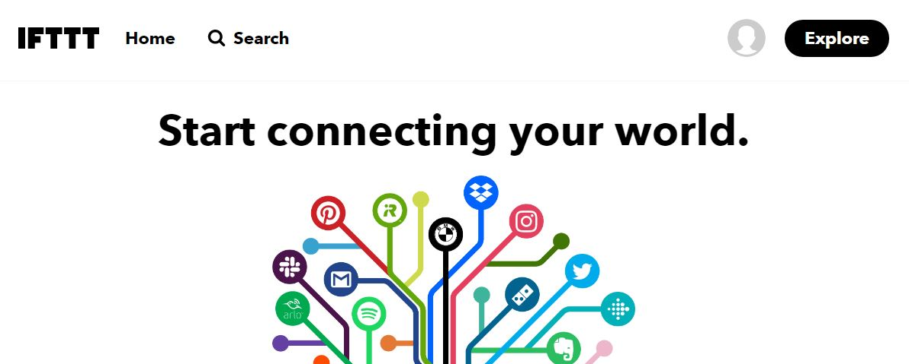
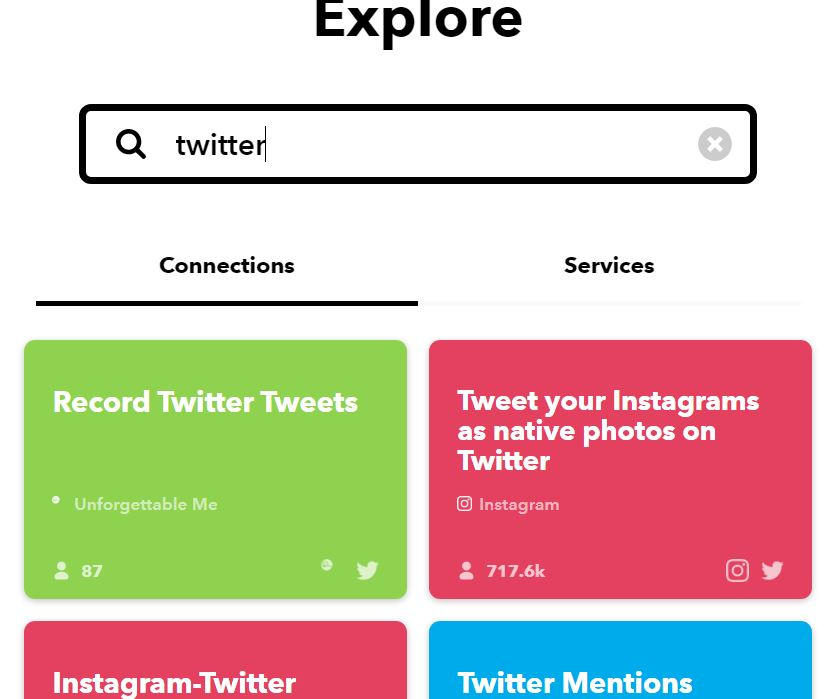
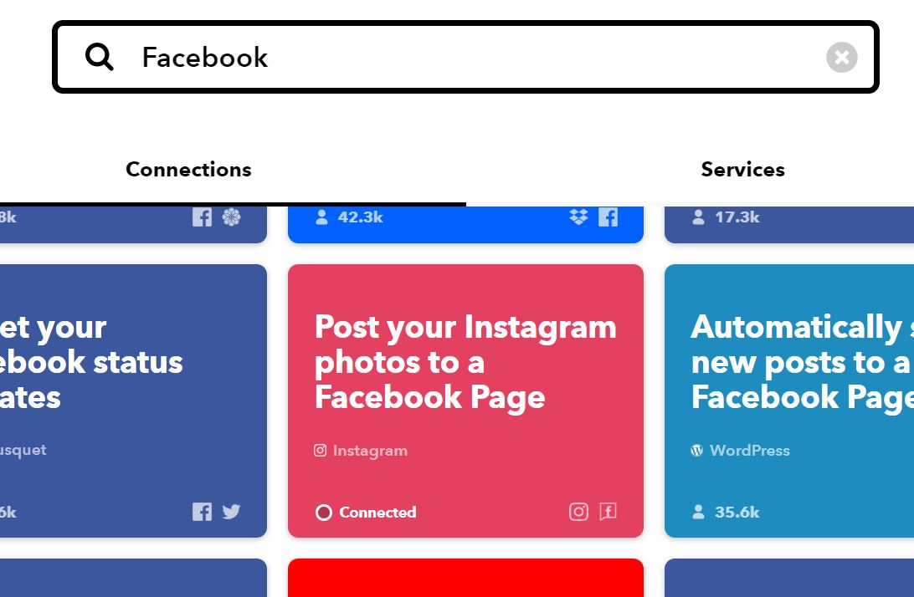
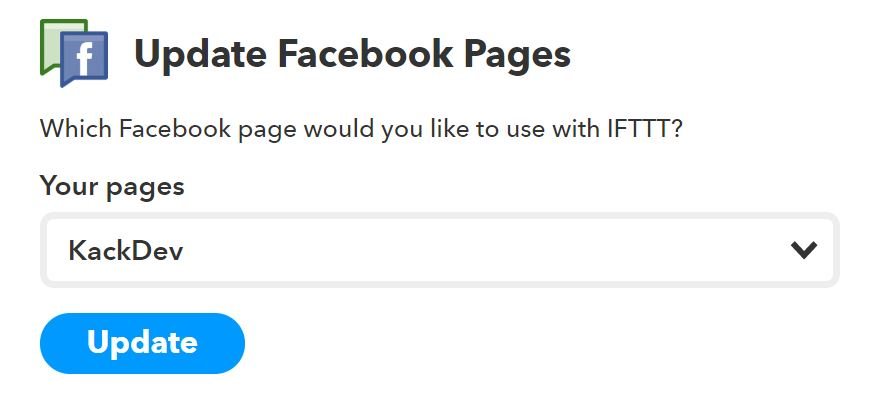
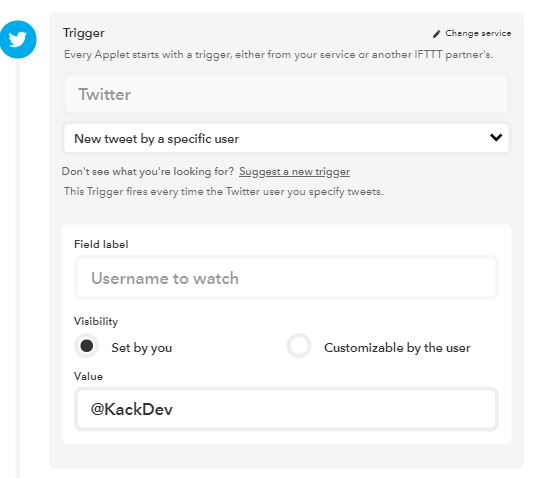
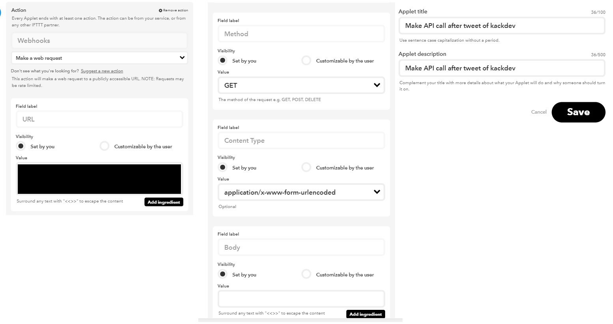
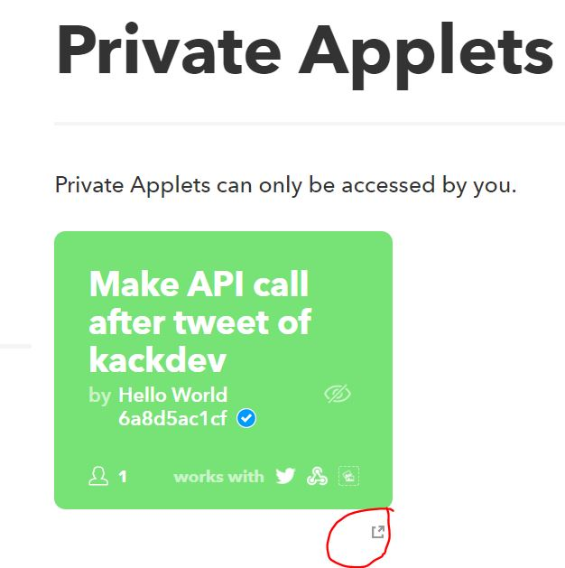

In my spare time I'm drawing cartoons. After finishing one, I want to publish it on several social media platforms:

+ Facebook
+ Instagram
+ Twitter

On every platform I have a personal profile where I publish everything and a profile for cartoons related to developer topics. The later are related to [KackDev](https://kack.dev). 

My workflow currently is:
+ Publish the post at [the KackDev Instagram account](https://www.instagram.com/kackdev)]
+ Publish the same at [the KackDev Twitter account](https://twitter.com/KackDev)
+ Publish the same at [the KackDev Facebook page](https://www.facebook.com/KackDev/)
+ Repost the twitter post [my twitter account](https://twitter.com/JosefBiehler)
+ Repost the Insta in my story at [my private Instagram account](https://www.instagram.com/josefbiehler)]
+ Publish the post at [my private Instagram account](https://www.instagram.com/josefbiehler)]
+ Pulish the post at [my private Facebook profile](https://www.facebook.com/KackDev)

Wow! Many steps that has to be done manually before I can annoy everyone with my bad drawings! 

I was asking myself if this can't be automated. Can it? Maybe!

# IFTTT
[**I**f **t**his **t**han **t**hat](https://ifttt.com) is a service where you can define workflows based upon start actions. E.g. "if I receive an email from xxx then send one to yyyy" and stuff like that.

It also provides Twitter, Instagram and Facebook integration. And it is free! Whoa!

**Accounts**

`IFTTT` allows only one Twitter/Instagram/Facebook connection per IFTTT account. As we want to control two social media profiles per platform, we need two `IFTTT` acccounts. In the remaining blog post I use the term `private IFTTT account` for that one that is connected to my private social media profiles. Accordingly I call my account that is linked to my `KackDev` social media profiles `KackDev IFTTT account`.

# Publishing to KackDev@Instagram
I use Planoly for this task. But it is not required. Planoly allows me in the free tier to maintain one Instagram account and to create many hashtag sets. The later is the reason why I fall back on a third party tool. I do not want to search the hashtags manually all the time I make a post.

# Publishing to KackDev@Twitter
Now I need a `Instam <-> Twitter` integration in my KackDev IFTTT account. Luckily someone has published such an applet at `ifttt`.

## Small IFTTT excurse
If you are new to IFTTT, your start screen will look like this:



Klick onto the magnifying glass at the top and type in "twitter". You will see many results.



We are interested in the second applet "Tweet your Instargams as native photos on Twitter". Click onto it. Press the big "Connect" Toggle. Now `ifttt` will redirect you to instagram which will ask you to authorize `ifttt`. In my case I link  my KackDev Instagram account with my KackDev IFTTT account. Now You will be redirected to IFTTT which then redirects you to Twitter. Here I link my KackDev Twitter account.

If you see following screen, everything works as expected:


## Finishing the integration
Well, nothing more has to be done. I have activated the applet, linked both social media accounts to my KackDev IFTTT account.

# Publish to KackDev@Facebook page
This one is easy. I go to my KackDev IFTTT account and search for "Facebook":



Click onto the applet "Post your Instagram photos to a Facebook page". Again IFTTT asks you to authenticate - this time against Facebook. In my case I select my private FB account. In the next step you select the facebook page.



# Sharing the post in your private social media profiles
What you have until now:
+ Create one post at Instagram
+ automatically create a tweet
+ automatically create a post in your Facebook page

Following steps are missing, yet:
+ Repost the twitter post @JosefBiehler
+ Repost the Insta in my story at @JosefBiehler
+ Publish the post at Instagram @JosefBiehler
+ Pulish the post at Facebook

## Repost the tweet in my @JiosefBiehler twitter acocunt
This is a bit more tricky. Twitter does not allow to define an applet that can retweet tweets of specific user. This can be solved by several ways. My prefered one is to write a small microservice that is triggered by IFTTT. You have to create or reuse existing tokens of your twitter developer account.

```js
const Twitter = require("twitter-lite");
const express = require("express");
require("./envvars");

function retweet(id, TWTR_CKEY, TWTR_CSECRET, TWTR_ATOKEN, TWTR_ASECRET) {
    const client = new Twitter({
        subdomain: "api",
        consumer_key: TWTR_CKEY,
        consumer_secret: TWTR_CSECRET,
        access_token_key: TWTR_ATOKEN,
        access_token_secret: TWTR_ASECRET
    });

    return client.post("statuses/retweet/" + id);
}

var app = express();
app.get("/", async (req, res) => {
    console.log("new request");
    const link = req.query.link;
    console.log("link: " + link);
    const id = link.match(/.*\/([0-9]{6,})/)[1];
    console.log("id: " + id);

    const secret = req.query.secret.trim();

    if (process.env.SECRET.indexOf(secret) <= -1) {
        console.log("wrong secret");
        res.sendStatus(401);
        return;
    }

    try {
        const result = await retweet(id, process.env.TWTR_CKEY, process.env.TWTR_CSECRET, process.env.TWTR_ATOKEN, process.env.TWTR_ASECRET);
        res.sendStatus(200);
    } catch(e) {
        console.log(JSON.stringify(e))
        res.sendStatus(500);
    }
});

app.listen(44320, () => console.log("listening on port 44320"));
```

The service is quite simple. It just accepts a `GET` request, containing the Tweeturl and a secret key as query parameter. From the URL the tweet ID is extracted and used to send the retweet request.

This service must run anywhere in the public www. Log in into your private IFTTT account, go to [platform.ifttt.com](https://platform.ifttt.com) and find the button to create a new applet:


>**Note**: Users in the free tier on ifttt can create applets for free but they can not pulish them to other users.

Create an applet with Twitter as Trigger and a Webhook as Action:




As `value` for the `URL` field in the webhook, you choose something like that:
`http://link-to-your-service/?link={{LinkToTweet}}&secret=a_secret`

After saving it, you can view it in your private ifttt account by clicking this icon:



If you click onto it, you are redirected to IFTTT and you can connect that applet to your account. During this process you will have to connect your private twitter profile with your ifttt account if you haven't done that yet.

**Result:**

Now for every tweet on @KackDev the microservice retweets that tweet to my private twitter account. 

## Reposting the post to my private FB & Instagram account

Well, due to breaking changes in the Facebook & Instagram API, no one is able to post to private FB and Instagram accounts anymore. That is sadly in our case because I have to do three manual steps and have no legal possibility to reduce this effort. 

If you want to get rid of at least one step you can convert your private instagram account into a business account. Then you are able to utilize the instagram API. Or maybe IFTTT would then be able to support you 

----

# Found a typo?
As I am not a native English speaker, it is very likely that you will find an error. In this case, feel free to create a pull request here: https://github.com/gabbersepp/dev.to-posts . Also please open a PR for all other kind of errors.

Do not worry about merge conflicts. I will resolve them on my own. 
